# ragweed-wgs-trait-mapping
Whole-genome sequencing and bulk segregant analysis for trait mapping in common ragweed (Ambrosia artemisiifolia).
## Project Overview

This repository documents a whole-genome sequencing (WGS) and bulk segregant analysis (BSA) workflow for identifying genomic regions and candidate variants associated with the target trait in common ragweed (*Ambrosia artemisiifolia*).

The analysis compares two bulked populations:

- **Resistant bulk (Res)**
- **Susceptible bulk (Sus)**

The workflow begins with raw paired-end sequencing reads and proceeds through read preprocessing, reference-genome alignment, variant calling, variant filtering, allele-frequency analysis, BSA, candidate-region identification, gene annotation, and functional consequence analysis of candidate variants.

Both SNPs and INDELs were identified during variant calling. The primary BSA workflow was subsequently focused on high-quality biallelic SNPs, while INDELs and multiallelic variants were retained as separate analysis branches for potential downstream investigation.

# ragweed-wgs-trait-mapping
Whole-genome sequencing and bulk segregant analysis for trait mapping in common ragweed (Ambrosia artemisiifolia).
## Project Overview

This repository documents a whole-genome sequencing (WGS) and bulk segregant analysis (BSA) workflow for identifying genomic regions and candidate variants associated with the target trait in common ragweed (*Ambrosia artemisiifolia*).

The analysis compares two bulked populations:

- **Resistant bulk (Res)**
- **Susceptible bulk (Sus)**

The workflow begins with raw paired-end sequencing reads and proceeds through read preprocessing, reference-genome alignment, variant calling, variant filtering, allele-frequency analysis, BSA, candidate-region identification, gene annotation, and functional consequence analysis of candidate variants.

Both SNPs and INDELs were identified during variant calling. The primary BSA workflow was subsequently focused on high-quality biallelic SNPs, while INDELs and multiallelic variants were retained as separate analysis branches for potential downstream investigation.

## Overall Workflow
## Overall Workflow


```mermaid
flowchart TD

    A["Raw paired-end WGS reads<br/>Res_S1 + Sus_S1"] --> B["Read cleaning with BBDuk<br/>adapter trimming + Q20 trimming<br/>minimum length = 70 bp"]

    B --> C["Clean paired-end reads<br/>CTRes_S1 + CTSus_S1"]

    C --> D["Reference preparation<br/>ragweed_ref.fasta<br/>BWA-MEM2 indexing"]

    D --> E["BWA-MEM2 alignment<br/>SAM → BAM → coordinate-sorted BAM"]

    E --> F["Add GATK read groups + BAM index<br/>CTRes_S1.rg.bam<br/>CTSus_S1.rg.bam"]

    F --> G["GATK HaplotypeCaller<br/>2 samples × 19 reference sequences<br/>= 38 parallel tasks"]

    G --> H["38 chromosome-specific GVCFs"]

    H --> I["Joint genotyping by chromosome<br/>19 GenomicsDB + GenotypeGVCFs tasks"]

    I --> J["19 joint-genotyped chromosome VCFs<br/>both Res + Sus in each VCF"]

    J --> K["Sample-level DP assessment<br/>FORMAT/DP<br/>Res median = 140×<br/>Sus median = 134×"]

    J --> L["Concatenate 19 chromosome VCFs"]

    L --> M["Genome-wide raw variant VCF<br/>50,391,840 records"]

    M --> N{"Separate variant types"}

    N --> N1["Raw SNPs<br/>42,192,206"]
    N --> N2["Raw INDELs<br/>7,741,330"]
    N --> N3["Other variant records<br/>458,304<br/>not carried into SNP/INDEL filtering"]

    N1 --> O1["SNP-specific GATK hard filtering<br/>31,187,098 retained<br/>11,005,108 removed"]

    N2 --> O2["INDEL-specific GATK hard filtering<br/>6,452,457 retained<br/>1,288,873 removed"]

    O1 --> P["Recombine + sort<br/>filtered_variants.vcf.gz<br/>37,639,555 variants"]
    O2 --> P

    P --> Q["Site-level DP QC<br/>INFO/DP<br/>Min 1× | Q1 157× | Median 304×<br/>Q3 430× | Max 15,038×"]

    P --> R["Sample-level DP filtering<br/>require BOTH samples DP 40–240<br/>and non-missing DP"]

    R --> S["Master depth-filtered VCF<br/>23,874,886 variants<br/>63.43% retained"]

    S -.-> FST["FST analysis<br/>planned complementary branch<br/>not yet completed"]

    S --> T{"Script 9a<br/>biallelic vs multiallelic"}

    T --> T1["Biallelic SNPs + INDELs<br/>22,690,750"]
    T --> T2["Multiallelic SNPs + INDELs<br/>1,184,136<br/>saved separately"]

    T1 --> U["Extract allele depth AD<br/>369 variants lacked usable AD"]

    U --> V["BSA allele-frequency table<br/>22,690,381 variants<br/>Res_AF, Sus_AF, Delta_AF"]

    V --> W1["Script 9b<br/>100-kb windows<br/>10,765 populated windows"]

    W1 --> W2["Script 9c<br/>100-kb genome-wide visualization<br/>Chr01–Chr18<br/>plot windows with N ≥ 1,000"]

    V --> X["Script 9d<br/>high-|Delta_AF| variants<br/>48,572 with |Delta_AF| ≥ 0.90<br/>19,549 with |Delta_AF| = 1"]

    V --> Y1["Script 9e<br/>10-kb windows<br/>~103,427 populated windows"]

    Y1 --> Y2["Script 9f<br/>10-kb genome-wide visualization<br/>Chr01–Chr18<br/>plot windows with N ≥ 100"]

    Y2 --> Z["Candidate-window refinement<br/>8 priority 10-kb windows<br/>5 Chr10 + Chr06 + Chr12 + Chr14"]

    Z --> AA["Query ragweed GFF<br/>for genes overlapping each peak"]

    AA --> AB{"Direct gene overlap?"}

    AB -->|No| AC["Nearby-gene search<br/>for biological follow-up"]

    AB -->|Yes| AD["Tier 1 direct-overlap genes<br/>3 genes on Chr10"]

    AD --> AE["Script 9g<br/>extract + rank variants<br/>inside Tier 1 genes"]

    AE --> AF["AmbAr_Ref_Chr10g221230<br/>77 variants<br/>max |Delta_AF| = 0.915493"]

    AE --> AG["AmbAr_Ref_Chr10g228000<br/>1 variant<br/>max |Delta_AF| = 0.315"]

    AE --> AH["AmbAr_Ref_Chr10g228010<br/>0 variants"]

    AF --> AI["Inspect gene structure<br/>3 exons<br/>72 CDS variants + 5 non-CDS"]

    AI --> AJ["Extract 77 gene variants<br/>from 9a.biallelic_variants.vcf.gz"]

    AJ --> AK["bcftools csq<br/>ragweed FASTA + GFF<br/>functional consequence annotation"]

    AK --> AL["9h.Chr10g221230_consequences.tsv"]

    AE --> AM["9g.tier1_candidate_gene_variants.tsv"]

    AL --> AN["Script 9h<br/>join by CHROM:POS:REF:ALT"]
    AM --> AN

    AN --> AO["Final ranked candidate table<br/>77 variants"]

    AO --> AP["38 missense<br/>33 synonymous<br/>4 intron<br/>1 in-frame insertion<br/>1 splice-region<br/>0 nonsense"]

    AP --> AQ["Priority protein-changing variants<br/>e.g. C→A L642F, Delta_AF = +0.8875<br/>A→G L646S, Delta_AF = +0.8455"]
```

## Detailed Pipeline Record

### 1. Raw Sequencing Data

Two bulked common ragweed (*Ambrosia artemisiifolia*) samples representing contrasting phenotypes were analyzed:

- **Resistant bulk**
- **Susceptible bulk**

The original paired-end sequencing files were:

- `Res_S1_R1_001.fastq.gz`
- `Res_S1_R2_001.fastq.gz`
- `Sus_S1_R1_001.fastq.gz`
- `Sus_S1_R2_001.fastq.gz`

These paired-end whole-genome sequencing reads provided the starting data for the mapping and BSA workflow.

**Next:** adapter and quality trimming.


### 2. Read Preprocessing and Cleaning

**Script:** `clean.sh`  
**Software:** BBTools / `bbduk.sh`

Read cleaning was performed in two stages.

#### 2.1 Adapter Trimming

Illumina TruSeq adapter contamination was removed using:

- `ktrim=r`
- `k=28`
- `mink=12`
- `hdist=1`
- Adapter reference: `truseq_rna.fa.gz`

Intermediate files:

- `C${name}_R1.fq`
- `C${name}_R2.fq`

#### 2.2 Quality Trimming

A second BBDuk step trimmed low-quality sequence using:

- `qtrim=rl`
- `trimq=20`
- `minlen=70`

Reads shorter than 70 bp after trimming were discarded.

Final cleaned reads were written using the `CT` prefix and moved to `clean_data/`.

The intermediate `C${name}*` files were removed after successful processing.

**Data reduction:** Read-level QC only; no variant dataset existed at this stage.

**Next:** Prepare the reference genome and align the cleaned reads.


### 3. Reference Genome Preparation

**Script:** `bwa_build.sh`  
**Software:** BWA-MEM2  
**Reference:** `ragweed_ref.fasta`

The common ragweed reference genome was prepared for read alignment by building a BWA-MEM2 index.

#### 3.1 Build the BWA-MEM2 Index

The reference genome was indexed using:

```bash
bwa-mem2 index -p ragweed_ref ragweed_ref.fasta


### 4. Read Alignment and BAM Generation

**Script:** `bwa_mem2.sh`  
**Software:** BWA-MEM2 and SAMtools  
**Reference index:** `ragweed_ref`

The cleaned paired-end reads from each bulk were aligned to the indexed common ragweed reference genome using BWA-MEM2.

#### 4.1 Align Cleaned Reads to the Reference Genome

For each sample, paired-end reads were aligned using:

```bash
bwa-mem2 mem -t 40 ragweed_ref ${name}_R1.fq ${name}_R2.fq > ${name}.sam
```

The alignment used **40 threads** and initially produced a SAM file for each sample.

#### 4.2 Convert SAM to BAM

The SAM alignment was converted to BAM format using SAMtools:

```bash
samtools view -bS -h ${name}.sam > ${name}.bam
```

#### 4.3 Sort the BAM File

The BAM file was then sorted by genomic coordinate:

```bash
samtools sort ${name}.bam -o ${name}.sorted.bam
```

#### 4.4 Retain Final Sorted BAM Files

The sorted BAM files were moved to:

```text
clean_data/bamfiles_bwa/
```

The intermediate `.sam` and unsorted `.bam` files were removed after successful conversion and sorting.

The two sorted BAM files used for downstream variant calling were:

```text
CTRes_S1.sorted.bam
CTSus_S1.sorted.bam
```

These represent the **Resistant** and **Susceptible** bulks, respectively.

**Data reduction:** None at the variant level. This step converted the cleaned sequencing reads into reference-aligned, coordinate-sorted BAM files.

**Next:** Add GATK-compatible read-group information and index the BAM files before variant calling.


### 5. Read-Group Addition and BAM Indexing

**Script:** `ragweed_rg_array.sh`  
**Software:** GATK and SAMtools  
**Execution:** SLURM array (`0-1`; one task per sample)

Before GATK HaplotypeCaller was run, the two sorted BAM files were prepared by adding the read-group information required for sample-aware GATK variant calling.

The two samples were:

- `CTRes_S1`
- `CTSus_S1`

The SLURM array assigned:

- Task 0 → `CTRes_S1`
- Task 1 → `CTSus_S1`

#### 5.1 Add Read Groups

GATK `AddOrReplaceReadGroups` was used to create a read-group BAM for each sample:

```bash
gatk AddOrReplaceReadGroups \
    -I "$BAM_DIR/${sm}.sorted.bam" \
    -O "$RG_DIR/${sm}.rg.bam" \
    -RGID $sm \
    -RGLB lib1 \
    -RGPL ILLUMINA \
    -RGPU unit1 \
    -RGSM $sm
```

The read-group fields were:

| Field | Meaning | Value |
|---|---|---|
| `RGID` | Read-group ID | Sample name |
| `RGLB` | Library | `lib1` |
| `RGPL` | Sequencing platform | `ILLUMINA` |
| `RGPU` | Platform unit | `unit1` |
| `RGSM` | Sample name | `CTRes_S1` or `CTSus_S1` |

The resulting BAM files were stored in:

```text
clean_data/bamfiles_bwa/rg_bam/
```

Final read-group BAMs:

```text
CTRes_S1.rg.bam
CTSus_S1.rg.bam
```

#### 5.2 Index the Read-Group BAM Files

Each read-group BAM was indexed using SAMtools:

```bash
samtools index "$RG_DIR/${sm}.rg.bam"
```

This produced:

```text
CTRes_S1.rg.bam.bai
CTSus_S1.rg.bam.bai
```

#### 5.3 Verify BAM Index Creation

The script explicitly checked that the `.bai` file existed before considering BAM preparation successful:

```bash
if [ ! -f "$RG_DIR/${sm}.rg.bam.bai" ]; then
    echo "ERROR: Index file was not created for $sm"
    exit 1
fi
```

This step was separated from chromosome-level variant calling because the same read-group BAM for each sample was subsequently accessed by all **19 chromosome/reference-sequence HaplotypeCaller tasks**.

**Data reduction:** None. Both samples and all aligned reads were retained; this was a BAM preparation step required for downstream GATK analysis.

**Next:** Run GATK HaplotypeCaller separately for each sample × reference sequence combination to generate chromosome-specific GVCFs.


### 6. Chromosome-Level Variant Calling in GVCF Mode

**Script:** `snpcalling_chrom_array.sh`  
**Software:** GATK HaplotypeCaller  
**Execution:** SLURM array (`0-37`; 38 parallel tasks)

Because whole-sample HaplotypeCaller runs were computationally expensive, variant calling was divided by both **sample** and **reference sequence**.

The analysis contained:

- **2 samples:** `CTRes_S1` and `CTSus_S1`
- **19 reference sequences:** `Chr01`–`Chr18` + `Chr00`
- **38 total HaplotypeCaller tasks:** 2 samples × 19 reference sequences

#### 6.1 Map Array Tasks to Samples and Reference Sequences

Each SLURM array task was assigned one sample and one reference sequence using:

```bash
sample_index=$((SLURM_ARRAY_TASK_ID / 19))
chrom_index=$((SLURM_ARRAY_TASK_ID % 19))

sm="${SAMPLES[$sample_index]}"
chr="${CHROMS[$chrom_index]}"
```

Therefore:

```text
Tasks 0–18  → CTRes_S1 × Chr01–Chr00
Tasks 19–37 → CTSus_S1 × Chr01–Chr00
```

This allowed the 38 sample × chromosome combinations to be processed independently.

#### 6.2 Verify the Pre-Created Read-Group BAM Index

Before HaplotypeCaller was started, each task checked that the BAM index generated in Section 5 existed:

```bash
if [ ! -f "$RG_DIR/${sm}.rg.bam.bai" ]; then
    echo "ERROR: Index file was not created for $sm"
    exit 1
fi
```

The same sample-level `.rg.bam` and `.rg.bam.bai` files were reused by all 19 chromosome tasks for that sample.

#### 6.3 Run GATK HaplotypeCaller

GATK HaplotypeCaller was run in **GVCF mode** for the chromosome assigned to each task:

```bash
gatk --java-options "-Xmx24g" HaplotypeCaller \
    -R "$REF" \
    -I "$RG_DIR/${sm}.rg.bam" \
    -L "$chr" \
    -O "$OUT_DIR/${sm}.${chr}.g.vcf.gz" \
    -ERC GVCF \
    --native-pair-hmm-threads 8 \
    --create-output-variant-index true
```

Important options:

| Option | Purpose |
|---|---|
| `-R` | Ragweed reference genome |
| `-I` | Read-group BAM for the assigned sample |
| `-L` | Restrict calling to the assigned reference sequence |
| `-ERC GVCF` | Produce a GVCF for later joint genotyping |
| `--native-pair-hmm-threads 8` | Use 8 threads for PairHMM calculations |
| `--create-output-variant-index true` | Create an index for each output GVCF |

#### 6.4 GVCF Outputs

The chromosome-specific GVCFs were stored in:

```text
clean_data/bamfiles_bwa/snp_chr_array/
```

For each sample, **19 GVCFs** were produced.

Examples:

```text
CTRes_S1.Chr01.g.vcf.gz
CTRes_S1.Chr02.g.vcf.gz
...
CTRes_S1.Chr18.g.vcf.gz
CTRes_S1.Chr00.g.vcf.gz

CTSus_S1.Chr01.g.vcf.gz
CTSus_S1.Chr02.g.vcf.gz
...
CTSus_S1.Chr18.g.vcf.gz
CTSus_S1.Chr00.g.vcf.gz
```

Thus, this stage produced **38 chromosome-specific GVCFs** in total.

At this stage, the GVCFs contained sample-specific genotype likelihood/reference-confidence information. The Resistant and Susceptible samples had **not yet been jointly genotyped**.

**Data reduction:** No variant filtering or candidate selection was performed. The dataset was divided computationally into 38 sample × reference-sequence GVCFs.

**Next:** Combine the Resistant and Susceptible GVCFs chromosome-by-chromosome using GenomicsDBImport and perform joint genotyping with GATK GenotypeGVCFs.


### 7. Chromosome-Level Joint Genotyping

**Script:** `joint_genotyping_19_array.sh`  
**Software:** GATK (`GenomicsDBImport` and `GenotypeGVCFs`)  
**Execution:** SLURM array (`0-18`; 19 tasks)

After chromosome-specific GVCFs were generated for both bulks, the Resistant and Susceptible samples were jointly genotyped.

Joint genotyping was performed separately for each of the **19 reference sequences**:

```text
Chr01–Chr18 + Chr00
```

Therefore, each SLURM array task processed one reference sequence and jointly analyzed the two samples:

```text
CTRes_S1
CTSus_S1
```

#### 7.1 Assign One Reference Sequence to Each Array Task

The 19 reference sequences were defined as:

```bash
CHRS=(
"Chr01" "Chr02" "Chr03" "Chr04" "Chr05" "Chr06"
"Chr07" "Chr08" "Chr09" "Chr10" "Chr11" "Chr12"
"Chr13" "Chr14" "Chr15" "Chr16" "Chr17" "Chr18"
"Chr00"
)

MY_CHR=${CHRS[$SLURM_ARRAY_TASK_ID]}
```

Thus:

```text
Task 0  → Chr01
Task 1  → Chr02
...
Task 17 → Chr18
Task 18 → Chr00
```

#### 7.2 Create a Chromosome-Specific Sample Map

For each reference sequence, a sample map was created containing the corresponding Resistant and Susceptible GVCFs.

For example, for `Chr01`:

```text
CTRes_S1    CTRes_S1.Chr01.g.vcf.gz
CTSus_S1    CTSus_S1.Chr01.g.vcf.gz
```

The script generated these files automatically as:

```text
sample_map_Chr01.txt
sample_map_Chr02.txt
...
sample_map_Chr18.txt
sample_map_Chr00.txt
```

This ensured that the two bulk samples were analyzed together for each reference sequence.

#### 7.3 Import the Two GVCFs into GenomicsDB

For each reference sequence, GATK `GenomicsDBImport` consolidated the two sample GVCFs into a chromosome-specific GenomicsDB workspace:

```bash
gatk --java-options "-Xmx100g -Xms100g" GenomicsDBImport \
    --genomicsdb-workspace-path "$DB_PATH" \
    --sample-name-map "$MAP" \
    -L "$MY_CHR" \
    --reader-threads "$SLURM_CPUS_PER_TASK" \
    --batch-size 50
```

A separate GenomicsDB workspace was therefore generated for every reference sequence:

```text
db_Chr01
db_Chr02
...
db_Chr18
db_Chr00
```

These databases organized the GVCF information from both bulks so that the samples could be jointly genotyped.

#### 7.4 Jointly Genotype Resistant and Susceptible Bulks

GATK `GenotypeGVCFs` was then run against each chromosome-specific GenomicsDB:

```bash
gatk --java-options "-Xmx100g" GenotypeGVCFs \
    -R "$REF" \
    -V "gendb://$DB_PATH" \
    -O "$OUT_DIR/raw_snps_${MY_CHR}.vcf.gz"
```

Unlike the sample-specific GVCFs from Section 6, these VCFs contained **joint genotype calls for both `CTRes_S1` and `CTSus_S1`**.

#### 7.5 Joint-Genotyped Outputs

The resulting VCFs were stored in:

```text
clean_data/bamfiles_bwa/joint_vcf/
```

A total of **19 chromosome/reference-sequence VCFs** were produced:

```text
raw_snps_Chr01.vcf.gz
raw_snps_Chr02.vcf.gz
...
raw_snps_Chr18.vcf.gz
raw_snps_Chr00.vcf.gz
```

Despite the `raw_snps_` filename prefix, these files represented the **raw joint-genotyped variant records** at this stage; SNP/INDEL separation and hard filtering were performed later.

**Data reduction:** The 38 sample-specific chromosome GVCFs from Section 6 were consolidated into 19 joint-genotyped chromosome/reference-sequence VCFs. This was a restructuring/joint-genotyping step rather than a quality-filtering step.

**Next:** Assess sample-level sequencing depth (`FORMAT/DP`) before selecting depth thresholds for downstream variant filtering.


### 8. Sample-Level Depth Assessment

**Script:** `dp_assessment.sh`  
**Software:** bcftools  
**Input:** 19 chromosome-specific joint-genotyped VCFs

Before applying depth-based filtering, sample-level sequencing depth was assessed separately for the Resistant and Susceptible bulks.

The purpose of this step was to determine the typical read depth of each bulk and use these values to establish a reasonable sample-level depth-filtering range.

#### 8.1 Extract Sample-Level FORMAT/DP

`FORMAT/DP` values were extracted separately for `CTRes_S1` and `CTSus_S1` from all 19 joint-genotyped VCF files:

```bash
bcftools query \
    -s CTRes_S1 \
    -f '[%DP\n]' \
    "$VCF" >> "$RES_DP"

bcftools query \
    -s CTSus_S1 \
    -f '[%DP\n]' \
    "$VCF" >> "$SUS_DP"
```

This was repeated across:

```text
raw_snps_Chr01.vcf.gz
...
raw_snps_Chr18.vcf.gz
raw_snps_Chr00.vcf.gz
```

Missing DP values were removed before calculating the medians.

#### 8.2 Calculate Median Depth for Each Bulk

The median `FORMAT/DP` was calculated independently for each sample.

The observed median depths were:

| Sample | Phenotype | Median FORMAT/DP |
|---|---|---:|
| `CTRes_S1` | Resistant bulk | **140×** |
| `CTSus_S1` | Susceptible bulk | **134×** |

The two bulks therefore had similar overall sequencing depth.

These sample-level median values were later used to guide the selection of the **40–240× FORMAT/DP range** applied to both samples during the second filtering stage.

#### 8.3 Output

The summary was saved as:

```text
bamfiles_bwa/DP_assessment/median_DP_summary.txt
```

with:

```text
Sample          Median_DP
CTRes_S1        140
CTSus_S1        134
```

**Data reduction:** None. This was a diagnostic/QC step only; no variants were removed.

**Important distinction:** This step assessed **sample-level `FORMAT/DP`**, not site-level `INFO/DP`. Site-level depth was examined separately later in the workflow.

**Next:** Concatenate the 19 chromosome/reference-sequence joint-genotyped VCFs into a single genome-wide raw variant VCF.


### 9. Concatenate Chromosome-Level Joint-Genotyped VCFs

**Script:** `concatenate_variants.sh`  
**Software:** bcftools  
**Input:** 19 chromosome/reference-sequence joint-genotyped VCFs  
**Output:** `all_raw_variants.vcf.gz`

After joint genotyping, the variant data were distributed across 19 separate VCF files (`Chr01`–`Chr18` + `Chr00`). These files were concatenated to create a single genome-wide VCF containing both the Resistant and Susceptible bulks.

#### 9.1 Concatenate the 19 VCF Files

The chromosome/reference-sequence files were explicitly supplied in reference order:

```text
Chr01 → Chr02 → ... → Chr18 → Chr00
```

They were concatenated using:

```bash
bcftools concat \
    -a \
    -O z \
    -o "$FINAL_VCF" \
    --threads "$SLURM_CPUS_PER_TASK" \
    "$VCF_DIR/raw_snps_Chr01.vcf.gz" \
    "$VCF_DIR/raw_snps_Chr02.vcf.gz" \
    "$VCF_DIR/raw_snps_Chr03.vcf.gz" \
    "$VCF_DIR/raw_snps_Chr04.vcf.gz" \
    "$VCF_DIR/raw_snps_Chr05.vcf.gz" \
    "$VCF_DIR/raw_snps_Chr06.vcf.gz" \
    "$VCF_DIR/raw_snps_Chr07.vcf.gz" \
    "$VCF_DIR/raw_snps_Chr08.vcf.gz" \
    "$VCF_DIR/raw_snps_Chr09.vcf.gz" \
    "$VCF_DIR/raw_snps_Chr10.vcf.gz" \
    "$VCF_DIR/raw_snps_Chr11.vcf.gz" \
    "$VCF_DIR/raw_snps_Chr12.vcf.gz" \
    "$VCF_DIR/raw_snps_Chr13.vcf.gz" \
    "$VCF_DIR/raw_snps_Chr14.vcf.gz" \
    "$VCF_DIR/raw_snps_Chr15.vcf.gz" \
    "$VCF_DIR/raw_snps_Chr16.vcf.gz" \
    "$VCF_DIR/raw_snps_Chr17.vcf.gz" \
    "$VCF_DIR/raw_snps_Chr18.vcf.gz" \
    "$VCF_DIR/raw_snps_Chr00.vcf.gz"
```

`bcftools concat` joined the reference-sequence VCFs end-to-end. It did **not** merge the Resistant and Susceptible samples because both samples were already jointly represented within every input VCF.

#### 9.2 Index the Genome-Wide VCF

The concatenated VCF was indexed using:

```bash
bcftools index -t "$FINAL_VCF"
```

This generated the corresponding tabix index and allowed efficient access to genomic regions during downstream analyses.

#### 9.3 Verify Samples and Variant Count

The samples present in the concatenated VCF were checked using:

```bash
bcftools query -l "$FINAL_VCF"
```

The expected samples were:

```text
CTRes_S1
CTSus_S1
```

The total number of variant records was then counted:

```bash
bcftools view -H "$FINAL_VCF" | wc -l
```

The genome-wide concatenated dataset contained:

**50,391,840 raw variant records**

#### 9.4 Output

The resulting genome-wide raw variant VCF was:

```text
bamfiles_bwa/variant_filtering/all_raw_variants.vcf.gz
```

with its tabix index:

```text
bamfiles_bwa/variant_filtering/all_raw_variants.vcf.gz.tbi
```

This file became the starting dataset for variant-level quality filtering.

#### 9.5 Dataset Status at This Stage

```text
19 joint-genotyped VCFs
        ↓
Concatenation
        ↓
50,391,840 raw variant records
        ↓
all_raw_variants.vcf.gz
```

No SNP/INDEL quality filtering had yet been applied. SNPs and INDELs were separated and hard-filtered in the next stage.

**Data reduction:** None. The **50,391,840** records were consolidated into one genome-wide VCF rather than reduced.

**Next:** Separate SNPs and INDELs, apply variant-type-specific GATK hard filters, retain passing variants, and recombine the filtered SNP and INDEL datasets.


### 10. Variant Quality Filtering: SNPs and INDELs

**Script:** `snp_filterin_rag.sh`  
**Software:** GATK and bcftools  
**Input:** `all_raw_variants.vcf.gz`  
**Starting dataset:** **50,391,840 raw variant records**  
**Final output:** `filtered_variants.vcf.gz`

The concatenated genome-wide VCF contained both SNPs and INDELs. Because SNPs and INDELs have different error characteristics, the two variant classes were separated and subjected to different GATK hard-filtering criteria.

After filtering, passing SNPs and INDELs were recombined into a single genome-wide quality-filtered VCF.

#### 10.1 Separate SNPs and INDELs

GATK `SelectVariants` was used to separate the raw variants into SNP and INDEL datasets.

SNPs:

```bash
gatk SelectVariants \
    -R "$REF" \
    -V "$INPUT_VCF" \
    --select-type-to-include SNP \
    -O "$OUT_DIR/raw_snps.vcf.gz"
```

INDELs:

```bash
gatk SelectVariants \
    -R "$REF" \
    -V "$INPUT_VCF" \
    --select-type-to-include INDEL \
    -O "$OUT_DIR/raw_indels.vcf.gz"
```

This produced:

```text
raw_snps.vcf.gz
raw_indels.vcf.gz
```

At this point, both datasets still contained unfiltered variants.

---

#### 10.2 Apply SNP-Specific Hard Filters

SNPs were evaluated using the following GATK hard-filter expression:

```text
QD < 2.0
OR MQ < 40.0
OR FS > 60.0
OR SOR > 3.0
OR MQRankSum < -12.5
OR ReadPosRankSum < -8.0
```

The filter was applied using:

```bash
gatk VariantFiltration \
    -R "$REF" \
    -V "$OUT_DIR/raw_snps.vcf.gz" \
    --filter-name "SNP_FILTER" \
    --filter-expression "QD < 2.0 || MQ < 40.0 || FS > 60.0 || SOR > 3.0 || MQRankSum < -12.5 || ReadPosRankSum < -8.0" \
    -O "$OUT_DIR/tagged_snps.vcf.gz"
```

The filtering metrics were:

| Metric | SNP failure threshold |
|---|---:|
| QD | `< 2.0` |
| MQ | `< 40.0` |
| FS | `> 60.0` |
| SOR | `> 3.0` |
| MQRankSum | `< -12.5` |
| ReadPosRankSum | `< -8.0` |

`VariantFiltration` initially **tagged** variants failing these criteria rather than immediately deleting them.

Passing SNPs were subsequently retained using:

```bash
gatk SelectVariants \
    -R "$REF" \
    -V "$OUT_DIR/tagged_snps.vcf.gz" \
    --exclude-filtered \
    -O "$OUT_DIR/filtered_snps.vcf.gz"
```

---

#### 10.3 Apply INDEL-Specific Hard Filters

INDELs were filtered separately using:

```text
QD < 2.0
OR FS > 200.0
OR SOR > 10.0
OR ReadPosRankSum < -20.0
```

The filter was applied using:

```bash
gatk VariantFiltration \
    -R "$REF" \
    -V "$OUT_DIR/raw_indels.vcf.gz" \
    --filter-name "INDEL_FILTER" \
    --filter-expression "QD < 2.0 || FS > 200.0 || SOR > 10.0 || ReadPosRankSum < -20.0" \
    -O "$OUT_DIR/tagged_indels.vcf.gz"
```

The INDEL thresholds were:

| Metric | INDEL failure threshold |
|---|---:|
| QD | `< 2.0` |
| FS | `> 200.0` |
| SOR | `> 10.0` |
| ReadPosRankSum | `< -20.0` |

Passing INDELs were then retained using:

```bash
gatk SelectVariants \
    -R "$REF" \
    -V "$OUT_DIR/tagged_indels.vcf.gz" \
    --exclude-filtered \
    -O "$OUT_DIR/filtered_indels.vcf.gz"
```

---

#### 10.4 Recombine Passing SNPs and INDELs

The quality-filtered SNP and INDEL datasets were recombined and sorted by genomic coordinate:

```bash
bcftools concat \
    -a \
    -O u \
    "$OUT_DIR/filtered_snps.vcf.gz" \
    "$OUT_DIR/filtered_indels.vcf.gz" | \
bcftools sort \
    -O z \
    -o "$OUT_DIR/filtered_variants.vcf.gz"
```

The resulting VCF was indexed:

```bash
bcftools index -t "$OUT_DIR/filtered_variants.vcf.gz"
```

Final output:

```text
bamfiles_bwa/variant_filtering/filtered_variants.vcf.gz
```

---

#### 10.5 Dataset Reduction After Quality Filtering

The starting genome-wide dataset contained:

**50,391,840 raw variant records**

After SNP- and INDEL-specific hard filtering and recombination:

**37,639,555 quality-filtered SNP + INDEL records were retained.**

Therefore:

```text
50,391,840 raw variants
        ↓
Separate SNPs and INDELs
        ↓
SNP-specific + INDEL-specific hard filtering
        ↓
Recombine passing variants
        ↓
37,639,555 quality-filtered variants
```

A total of:

**12,752,285 variant records**

were removed during this quality-filtering stage, corresponding to approximately **25.3%** of the original raw variant records.

Approximately **74.7%** of the raw variant records were retained.

**Important:** SNPs and INDELs were both retained at this stage. INDELs were not discarded from the analysis; they were filtered using their own criteria and recombined with the passing SNPs.

**Next:** Assess site-level `INFO/DP` across the **37,639,555 quality-filtered variants** before applying the subsequent sample-level `FORMAT/DP` filter.


### 11. Site-Level Depth Assessment

**Script:** `site_DP_assessment.sh`  
**Software:** bcftools  
**Input:** `filtered_variants.vcf.gz`  
**Input dataset:** **37,639,555 quality-filtered SNPs + INDELs**

After variant-level hard filtering, site-level sequencing depth was examined across the quality-filtered variant dataset.

This assessment was performed to characterize the depth distribution of variant sites before deciding how depth should be handled in the downstream analysis.

Importantly, this step examined **site-level `INFO/DP`**, which is different from the sample-level `FORMAT/DP` assessed previously.

#### 11.1 Site-Level DP vs. Sample-Level DP

The two depth measurements used during the workflow represent different quantities:

| Depth field | Level | Interpretation |
|---|---|---|
| `FORMAT/DP` | Individual sample | Read depth for a particular sample at a variant |
| `INFO/DP` | Variant site | Approximate total depth associated with the variant site across samples |

The earlier sample-level assessment produced median depths of:

```text
CTRes_S1 = 140×
CTSus_S1 = 134×
```

The present step instead examined the `INFO/DP` field for each retained variant record.

#### 11.2 Extract Site-Level INFO/DP

Site-level depth was extracted from:

```text
bamfiles_bwa/variant_filtering/filtered_variants.vcf.gz
```

using:

```bash
bcftools query \
    -f '%INFO/DP\n' \
    "$INPUT_VCF" > "$SITE_DP"
```

This generated:

```text
bamfiles_bwa/site_DP_assessment/site_DP_values.txt
```

Each line contained the `INFO/DP` value associated with one variant record.

Missing or empty DP values were removed:

```bash
sed -i '/^\.$/d;/^$/d' "$SITE_DP"
```

#### 11.3 Calculate Median Site-Level DP

The number of valid site-level DP observations was counted and the values were numerically sorted to determine the median.

For an odd number of observations, the middle value was used.

For an even number of observations, the two middle values were averaged.

The summary was written to:

```text
bamfiles_bwa/site_DP_assessment/site_DP_summary.txt
```

#### 11.4 Role of This Assessment in the Final Filtering Strategy

This site-level depth analysis was used as a **QC/exploratory assessment**.

It was **not used as the final depth-filtering criterion**.

For the downstream BSA analysis, depth filtering was instead based on the **sample-level `FORMAT/DP` of each bulk**, because the Resistant and Susceptible samples needed to have adequate and reasonably bounded coverage independently.

The final sample-level depth requirement applied later was:

```text
CTRes_S1: 40 ≤ FORMAT/DP ≤ 240
CTSus_S1: 40 ≤ FORMAT/DP ≤ 240
```

and **both samples were required to satisfy this range at a variant site**.

Therefore, the workflow deliberately distinguished:

```text
Site-level INFO/DP
        ↓
Exploratory depth assessment / QC
        ↓
Not used as the final DP filter

Sample-level FORMAT/DP
        ↓
Median Res = 140×
Median Sus = 134×
        ↓
Final filtering range selected: 40–240× in BOTH samples
```

**Data reduction:** None. No variants were removed during the site-level DP assessment.

**Next:** Examine the distribution of site-level `INFO/DP` values (minimum, Q1, median, Q3, and maximum) before proceeding to the final sample-level depth filter.


### 12. Site-Level DP Distribution Assessment

**Script:** `site_DP_distribution.sh`  
**Input:** `site_DP_values.txt`  
**Input source:** Site-level `INFO/DP` values extracted in Section 11

After extracting site-level `INFO/DP`, the depth values were examined in greater detail to characterize their genome-wide distribution.

This was an **exploratory/QC step**. The site-level depth distribution was not used directly to remove variants.

#### 12.1 Sort Site-Level DP Values

The `INFO/DP` values generated in Section 11 were sorted numerically:

```bash
sort -n "$SITE_DP" > "$SORTED_DP"
```

This produced:

```text
bamfiles_bwa/site_DP_assessment/site_DP_values_sorted.txt
```

The original `site_DP_values.txt` file was retained unchanged.

#### 12.2 Calculate Distribution Statistics

The sorted site-level DP values were used to determine:

- Minimum DP
- Q1 (25th percentile)
- Median (50th percentile)
- Q3 (75th percentile)
- Maximum DP

The number of valid site-level DP observations was first determined:

```bash
N=$(wc -l < "$SORTED_DP")
```

Quartile positions were then calculated from the ordered DP values.

The median was calculated separately depending on whether the number of observations was odd or even.

For an odd number of observations, the middle value was used.

For an even number of observations, the two middle values were averaged.

#### 12.3 Output

The distribution statistics were saved as:

```text
bamfiles_bwa/site_DP_assessment/site_DP_distribution_summary.txt
```

with the following structure:

```text
Statistic              DP
Minimum                <observed value>
Q1_25_percent          <observed value>
Median_50_percent      <observed value>
Q3_75_percent          <observed value>
Maximum                <observed value>
```

The complete sorted DP values were also retained in:

```text
site_DP_values_sorted.txt
```

#### 12.4 Interpretation and Decision

This assessment was performed to understand whether the site-level depth distribution contained unusually low- or high-depth regions and to provide additional context for selecting a depth-filtering strategy.

However, **site-level `INFO/DP` was not used for the final depth filter**.

Instead, the downstream filtering decision was based on the sample-level depth of each bulk:

```text
CTRes_S1 median FORMAT/DP = 140×
CTSus_S1 median FORMAT/DP = 134×
```

The final selected range was:

```text
40 ≤ FORMAT/DP ≤ 240
```

and this requirement had to be satisfied independently by **both** the Resistant and Susceptible bulks.

This decision avoided relying on a combined site-level depth value that could potentially conceal unequal coverage between the two bulks.

#### 12.5 Workflow Decision

```text
37,639,555 quality-filtered variants
        ↓
Extract site-level INFO/DP
        ↓
Assess median and DP distribution
        ↓
Site-level DP retained as QC information
        ↓
Do NOT filter using INFO/DP
        ↓
Proceed with sample-level FORMAT/DP filtering
```

**Data reduction:** None. This step characterized the depth distribution but did not remove any variants.

**Next:** Apply the second filtering stage using `FORMAT/DP = 40–240×` independently in both `CTRes_S1` and `CTSus_S1`.


### 13. Filtering 2: Sample-Level FORMAT/DP Filtering

**Script:** `filtering2_sample_M_DP.sh`  
**Software:** bcftools  
**Input:** `filtered_variants.vcf.gz`  
**Starting dataset:** **37,639,555 quality-filtered SNPs + INDELs**  
**Output:** `filtered2_sampleDP_variants.vcf.gz`

After SNP/INDEL quality filtering and the depth assessments described above, a second filtering stage was performed using **sample-level `FORMAT/DP`**.

The objective was to retain variants with adequate but not excessively high read depth in **both** the Resistant and Susceptible bulks.

#### 13.1 Basis for the Sample-Level DP Filter

The sample-level depth assessment in Section 8 showed:

| Sample | Bulk | Median FORMAT/DP |
|---|---|---:|
| `CTRes_S1` | Resistant | **140×** |
| `CTSus_S1` | Susceptible | **134×** |

Based on these sample-level depth distributions, the downstream filtering range was set to:

```text
40 ≤ FORMAT/DP ≤ 240
```

Importantly, **both samples had to independently satisfy this range at the same variant site**.

Thus, a variant was retained only when:

```text
CTRes_S1: 40 ≤ DP ≤ 240
AND
CTSus_S1: 40 ≤ DP ≤ 240
```

This differs from filtering on site-level `INFO/DP`, because each bulk was evaluated separately.

#### 13.2 Apply the FORMAT/DP Filter

The filter was applied using:

```bash
bcftools view \
    -i 'FMT/DP[0]>=40 && FMT/DP[0]<=240 && FMT/DP[1]>=40 && FMT/DP[1]<=240' \
    -O z \
    -o "$DP_FILTERED_VCF" \
    "$INPUT_VCF"
```

The sample order had been verified previously as:

```text
Sample 0 = CTRes_S1
Sample 1 = CTSus_S1
```

Therefore:

```text
FMT/DP[0] → CTRes_S1
FMT/DP[1] → CTSus_S1
```

A site failing the depth requirement in **either bulk** was excluded.

#### 13.3 Index the Depth-Filtered VCF

The resulting VCF was indexed using:

```bash
bcftools index -t "$DP_FILTERED_VCF"
```

Final output:

```text
bamfiles_bwa/variant_filtering/filtered2_sampleDP_variants.vcf.gz
```

with its corresponding tabix index.

#### 13.4 Dataset Reduction

The input to this filtering stage contained:

```text
37,639,555 quality-filtered SNPs + INDELs
```

After requiring `FORMAT/DP = 40–240×` in **both bulks**, approximately:

```text
~23.87 million variants
```

were retained for downstream analysis.

The workflow at this point was therefore:

```text
50,391,840 raw variant records
        ↓
SNP/INDEL hard filtering
        ↓
37,639,555 quality-filtered variants
        ↓
Sample-level FORMAT/DP filter
40–240× in BOTH bulks
        ↓
~23.87 million depth-filtered variants
        ↓
filtered2_sampleDP_variants.vcf.gz
```

#### 13.5 Why Sample-Level Rather Than Site-Level DP Was Used

Although site-level `INFO/DP` was examined in Sections 11–12, it was not used as the final depth filter.

The final filtering strategy used sample-level `FORMAT/DP` because the Resistant and Susceptible bulks needed to have sufficient coverage **independently**.

This prevents a high combined site depth from masking poor coverage in one of the two bulks.

#### 13.6 Status of Variant Types at This Stage

Both:

```text
SNPs
+
INDELs
```

were still retained.

No biallelic/multiallelic separation had yet been performed.

That separation occurred at the beginning of the BSA analysis in **Script 9a**, where:

- **Biallelic SNPs + INDELs** were used for the main allele-frequency analysis.
- **Multiallelic SNPs + INDELs** were saved separately rather than discarded.

**Next:** Begin BSA by separating biallelic and multiallelic variants and calculating Resistant AF, Susceptible AF, and `Delta_AF` from allele depths.

### 14. Bulk Segregant Analysis (BSA)

The depth-filtered variant dataset was used for bulk segregant analysis to identify genomic regions and individual variants showing strong allele-frequency differentiation between the Resistant and Susceptible bulks.

The BSA workflow consisted of:

1. Separating biallelic and multiallelic variants.
2. Calculating allele frequencies from allele depths (`FORMAT/AD`).
3. Calculating `Delta_AF` between the Resistant and Susceptible bulks.
4. Summarizing differentiation in 100-kb and 10-kb genomic windows.
5. Identifying individual variants with high `|Delta_AF|`.
6. Identifying candidate genes overlapping the strongest BSA regions.
7. Examining variants within Tier 1 candidate genes.
8. Adding functional consequence annotations to prioritized variants.

---

#### 14.1 Allele-Frequency Calculation and Biallelic/Multiallelic Separation

**Script:** `9a.allele_freq_BSA.sh`  
**Software:** bcftools and AWK  
**Input:** `filtered2_sampleDP_variants.vcf.gz`  
**Input dataset:** approximately **23.87 million depth-filtered SNPs + INDELs**  
**Main output:** `9a.allele_freq_BSA.tsv`

The first BSA step separated biallelic and multiallelic variants and calculated allele frequencies independently for the Resistant and Susceptible bulks.

##### 14.1.1 Separate Biallelic Variants

The main BSA analysis was restricted to **biallelic SNPs and INDELs**:

```bash
bcftools view \
    -m2 \
    -M2 \
    -v snps,indels \
    -O z \
    -o "$BIALLELIC_VCF" \
    "$INPUT_VCF"
```

This produced:

```text
9a.biallelic_variants.vcf.gz
```

At a biallelic site there is exactly:

```text
1 REF allele + 1 ALT allele
```

Therefore, the `FORMAT/AD` field has the simple structure:

```text
REF_depth,ALT_depth
```

This allowed ALT allele frequency to be calculated directly and consistently for both bulks.

##### 14.1.2 Preserve Multiallelic Variants Separately

Multiallelic variants were **not discarded**.

They were extracted into a separate VCF:

```bash
bcftools view \
    -m3 \
    -v snps,indels \
    -O z \
    -o "$MULTIALLELIC_VCF" \
    "$INPUT_VCF"
```

Output:

```text
9a.multiallelic_variants.vcf.gz
```

These variants were excluded from the primary allele-frequency calculation because their `AD` fields can contain multiple ALT allele depths and therefore cannot be interpreted using the simple biallelic `REF,ALT` calculation.

However, they were preserved for possible later inspection within candidate resistance regions.

##### 14.1.3 Extract Allele Depths

For the biallelic variants, chromosome, position, REF, ALT, and allele depths were extracted:

```bash
bcftools query \
    -f '%CHROM\t%POS\t%REF\t%ALT[\t%AD]\n' \
    "$BIALLELIC_VCF" \
    > "$RAW_AD"
```

This produced:

```text
9a.raw_AD.tsv
```

The previously verified sample order was:

```text
CTRes_S1
CTSus_S1
```

For each sample:

```text
AD = REF read depth, ALT read depth
```

##### 14.1.4 Calculate Resistant and Susceptible Allele Frequencies

For each biallelic variant:

```text
Res_AF = Res_ALT_AD / (Res_REF_AD + Res_ALT_AD)

Sus_AF = Sus_ALT_AD / (Sus_REF_AD + Sus_ALT_AD)
```

For example, if the Resistant bulk had:

```text
REF depth = 10
ALT depth = 90
```

then:

```text
Res_AF = 90 / (10 + 90)
       = 0.90
```

Thus, `AF` in this workflow represents the frequency of the **ALT allele**, not the REF allele.

##### 14.1.5 Calculate Delta_AF

Allele-frequency differentiation between the two bulks was calculated as:

```text
Delta_AF = Res_AF - Sus_AF
```

Interpretation:

```text
Delta_AF > 0
→ ALT allele is more frequent in the Resistant bulk

Delta_AF < 0
→ ALT allele is more frequent in the Susceptible bulk

Delta_AF ≈ 0
→ Similar ALT allele frequencies in the two bulks
```

The magnitude:

```text
|Delta_AF|
```

was subsequently used to measure the strength of differentiation regardless of direction.

The theoretical range is:

```text
-1 ≤ Delta_AF ≤ +1
```

where:

```text
Delta_AF = +1
→ ALT allele fixed in Resistant and absent in Susceptible

Delta_AF = -1
→ ALT allele absent in Resistant and fixed in Susceptible
```

##### 14.1.6 Identify SNPs and INDELs

Each retained variant was classified from its REF and ALT allele lengths:

```text
REF length = 1 and ALT length = 1
→ SNP

otherwise
→ INDEL
```

Both variant types remained in the main BSA analysis.

##### 14.1.7 Main BSA Allele-Frequency Table

The resulting table was:

```text
9a.allele_freq_BSA.tsv
```

with the following columns:

```text
CHROM
POS
TYPE
REF
ALT
Res_REF_AD
Res_ALT_AD
Res_AF
Sus_REF_AD
Sus_ALT_AD
Sus_AF
Delta_AF
```

Therefore, each row contained both the underlying read-depth evidence and the calculated allele-frequency difference between the two bulks.

##### 14.1.8 Important Dataset Branch at This Stage

This step created two distinct branches:

```text
filtered2_sampleDP_variants.vcf.gz
            │
            ├── Biallelic SNPs + INDELs
            │        ↓
            │   9a.biallelic_variants.vcf.gz
            │        ↓
            │   Extract FORMAT/AD
            │        ↓
            │   Calculate Res_AF and Sus_AF
            │        ↓
            │   Calculate Delta_AF
            │        ↓
            │   9a.allele_freq_BSA.tsv
            │        ↓
            │   MAIN BSA ANALYSIS
            │
            └── Multiallelic SNPs + INDELs
                     ↓
                9a.multiallelic_variants.vcf.gz
                     ↓
                SAVED SEPARATELY
                for possible later inspection
```

**Important:** Multiallelic variants were therefore **set aside rather than permanently removed** from the project.

**Next:** Aggregate the variant-level `Delta_AF` values into **100-kb non-overlapping genomic windows** to identify broader regions of differentiation between the Resistant and Susceptible bulks.


#### 14.2 100-kb Window-Based BSA

**Script:** `9b.window_BSA_100kb.sh`  
**Input:** `9a.allele_freq_BSA.tsv`  
**Window size:** **100,000 bp (100 kb)**  
**Output:** `9b.window_BSA_100kb.tsv`

After calculating `Delta_AF` for individual variants, the next step was to determine whether allele-frequency differentiation was concentrated within broader genomic regions.

Individual variants were therefore grouped into **non-overlapping 100-kb windows** across the ragweed genome.

##### 14.2.1 Assign Variants to 100-kb Windows

Each variant was assigned to a genomic window according to its chromosome and position:

```text
1–100,000
100,001–200,000
200,001–300,000
...
```

The window coordinates were calculated as:

```awk
window_start = int((pos - 1) / W) * W + 1
window_end   = window_start + W - 1
```

where:

```text
W = 100,000 bp
```

##### 14.2.2 Calculate Statistics for Each Window

Three statistics were calculated for every window containing variants:

```text
N_VARIANTS
MEAN_DELTA_AF
MEAN_ABS_DELTA_AF
```

**`N_VARIANTS`** represents the number of biallelic SNPs + INDELs contributing to that window.

**`MEAN_DELTA_AF`** was calculated as:

```text
sum(Delta_AF) / N_VARIANTS
```

Because the sign was retained:

```text
Positive MEAN_DELTA_AF
→ overall ALT enrichment toward the Resistant bulk

Negative MEAN_DELTA_AF
→ overall ALT enrichment toward the Susceptible bulk
```

However, positive and negative variants within the same window can partially cancel each other.

For this reason, **mean absolute Delta_AF** was also calculated:

```text
MEAN_ABS_DELTA_AF =
sum(|Delta_AF|) / N_VARIANTS
```

This measures the overall magnitude of differentiation within a window regardless of which bulk carries the ALT allele at individual sites.

##### 14.2.3 Sort Windows in Genomic Order

Because AWK associative arrays do not preserve genomic order, the resulting windows were sorted by:

```text
1. Chromosome
2. Window start position
```

using:

```bash
tail -n +2 "$WINDOW_OUTPUT" | sort -k1,1V -k2,2n
```

##### 14.2.4 Output Table

The final 100-kb window table was:

```text
9b.window_BSA_100kb.tsv
```

with columns:

```text
CHROM
WINDOW_START
WINDOW_END
N_VARIANTS
MEAN_DELTA_AF
MEAN_ABS_DELTA_AF
```

Thus, the analysis progressed from individual variant-level differentiation to regional differentiation:

```text
9a.allele_freq_BSA.tsv
        ↓
Individual variant Delta_AF values
        ↓
Group variants into 100-kb windows
        ↓
N_VARIANTS
MEAN_DELTA_AF
MEAN_ABS_DELTA_AF
        ↓
9b.window_BSA_100kb.tsv
```

##### 14.2.5 Role of the 100-kb Analysis

The 100-kb analysis provided a **broad genome-wide scan** for regions showing consistently elevated differentiation between the two bulks.

`MEAN_ABS_DELTA_AF` was particularly useful for identifying regions with strong overall differentiation because it does not allow positive and negative `Delta_AF` values to cancel each other.

The 100-kb analysis was subsequently complemented by a **10-kb window analysis** to obtain higher genomic resolution.

**Data reduction:** No variants were removed from the underlying `9a` BSA dataset. Individual variants were summarized into genomic windows for regional analysis.

**Next:** Visualize `MEAN_ABS_DELTA_AF` across `Chr01–Chr18` using the 100-kb window results.


#### 14.3 Genome-Wide Visualization of 100-kb BSA Windows

**Script:** `9c.genome_wide_visual_BSA_100kbwindow.sh`  
**Software:** Python, pandas, matplotlib  
**Input:** `9b.window_BSA_100kb.tsv`  
**Outputs:** `9c.genome_wide_visual_BSA_100kbwindow.png` and `.pdf`

The 100-kb window results were visualized across the genome to identify chromosomes and genomic regions showing elevated differentiation between the Resistant and Susceptible bulks.

The primary statistic visualized was:

```text
MEAN_ABS_DELTA_AF
```

This represents the mean magnitude of allele-frequency differentiation within each 100-kb window, regardless of whether the ALT allele was enriched in the Resistant or Susceptible bulk.

##### 14.3.1 Exclude Chr00 From the Main Genome-Wide Plot

`Chr00` contains unplaced/unassigned sequence and was therefore excluded from the main chromosome-level visualization:

```python
df = df[df["CHROM"] != "Chr00"].copy()
```

Importantly, `Chr00` was **not removed from the underlying BSA dataset**. It was excluded only from this visualization.

The main plot therefore included:

```text
Chr01–Chr18
```

##### 14.3.2 Require Adequate Variant Support per Window

For visualization, only 100-kb windows containing at least:

```text
N_VARIANTS ≥ 1000
```

were plotted:

```python
df = df[df["N_VARIANTS"] >= 1000].copy()
```

This threshold was used as a **visualization/QC criterion** so that plotted window estimates were supported by a substantial number of variants.

It did not modify or filter the original `9b.window_BSA_100kb.tsv` dataset.

##### 14.3.3 Arrange Chromosomes in Numerical Order

Chromosomes were explicitly ordered as:

```text
Chr01, Chr02, Chr03, ... Chr18
```

rather than relying on alphabetical sorting.

A cumulative genome coordinate was then generated so that all 18 chromosomes could be displayed consecutively along a single x-axis.

A **1-Mb visual gap** was inserted between chromosomes:

```python
offset += chrom_length + 1000000
```

This gap was added only for visualization and does not represent biological sequence.

##### 14.3.4 Plot Mean Absolute Delta_AF

Each qualifying 100-kb window was represented according to:

```text
X-axis = cumulative genomic position
Y-axis = MEAN_ABS_DELTA_AF
```

The plot therefore provided a genome-wide view of the magnitude of allele-frequency differentiation between the two bulks.

Interpretation:

```text
Higher MEAN_ABS_DELTA_AF
        ↓
Greater average allele-frequency difference
between Resistant and Susceptible bulks
within that 100-kb region
```

Because absolute `Delta_AF` was plotted, the graph emphasized the **strength of differentiation**, not its direction.

##### 14.3.5 Plot Outputs

The genome-wide visualization was saved in both PNG and PDF formats:

```text
9c.genome_wide_visual_BSA_100kbwindow.png
9c.genome_wide_visual_BSA_100kbwindow.pdf
```

The PNG was generated at:

```text
300 dpi
```

while the PDF provided a scalable version suitable for detailed inspection.

##### 14.3.6 Role of the 100-kb Genome-Wide Plot

This visualization served as the broad genome-wide BSA scan:

```text
Variant-level Delta_AF
        ↓
100-kb window summaries
        ↓
Require ≥1000 variants/window for plotting
        ↓
Exclude Chr00 from visualization only
        ↓
Plot MEAN_ABS_DELTA_AF across Chr01–Chr18
        ↓
Identify broad regions of elevated differentiation
```

No candidate region was selected solely because of this visualization. The analysis was subsequently examined at higher resolution using **10-kb windows** and at the individual-variant level using high `|Delta_AF|` variants.

**Data reduction:** None in the underlying BSA dataset. `Chr00` and windows with fewer than 1000 variants were excluded **only from this plot**.

**Next:** Identify individual variants showing particularly strong allele-frequency differentiation between the two bulks using `|Delta_AF|` thresholds.


#### 14.4 High-|Delta_AF| Variant Analysis

**Script:** `9d.high_deltaAF_variants.sh`  
**Input:** `9a.allele_freq_BSA.tsv`  
**Output:** `9d.high_deltaAF_variants.tsv`

In addition to the window-based BSA analysis, individual variants were examined directly to identify sites showing large allele-frequency differences between the Resistant and Susceptible bulks.

For each variant:

```text
Delta_AF = Res_AF - Sus_AF
```

and the magnitude of differentiation was represented as:

```text
|Delta_AF|
```

Because the absolute value was used, strong differentiation toward either bulk could be retained.

##### 14.4.1 Interpret Delta_AF Direction

The possible range is:

```text
-1 ≤ Delta_AF ≤ +1
```

Interpretation:

| Delta_AF | Meaning |
|---:|---|
| `+1.0` | ALT allele fixed in Resistant and absent in Susceptible |
| Near `+1` | ALT allele strongly enriched in Resistant |
| Near `0` | Similar ALT frequency in both bulks |
| Near `-1` | ALT allele strongly enriched in Susceptible |
| `-1.0` | ALT allele absent in Resistant and fixed in Susceptible |

For example:

```text
Res_AF = 0.90
Sus_AF = 0.10

Delta_AF = 0.90 - 0.10
         = +0.80
```

indicates strong ALT-allele enrichment in the Resistant bulk.

##### 14.4.2 Extract High-Differentiation Variants

Variants satisfying:

```text
|Delta_AF| ≥ 0.70
```

were extracted from the complete BSA table.

Conceptually:

```text
9a.allele_freq_BSA.tsv
        ↓
Calculate |Delta_AF|
        ↓
Retain |Delta_AF| ≥ 0.70
        ↓
9d.high_deltaAF_variants.tsv
```

The original `9a.allele_freq_BSA.tsv` remained unchanged.

##### 14.4.3 Evaluate Increasingly Stringent Thresholds

The script also counted variants at several levels of differentiation:

```text
|Delta_AF| ≥ 0.70
|Delta_AF| ≥ 0.80
|Delta_AF| ≥ 0.90
|Delta_AF| = 1.00
```

This allowed the strength of the genome-wide BSA signal to be evaluated without immediately restricting the analysis to only completely differentiated variants.

##### 14.4.4 Complete Differentiation

A completely differentiated variant occurs when one bulk has an ALT allele frequency of 1 and the other has an ALT allele frequency of 0.

Two directions were counted separately.

**ALT fixed in Resistant:**

```text
Res_AF = 1
Sus_AF = 0
Delta_AF = +1
```

**ALT fixed in Susceptible:**

```text
Res_AF = 0
Sus_AF = 1
Delta_AF = -1
```

The analysis identified:

```text
19,549 variants with |Delta_AF| = 1
```

consisting of:

```text
10,667 variants with Delta_AF = +1
8,882 variants with Delta_AF = -1
```

Thus:

```text
10,667 + 8,882 = 19,549
```

completely differentiated variants were detected.

Relative to the approximately 22.69 million variants in the BSA allele-frequency table, these completely differentiated variants represented only about:

```text
0.086%
```

of the BSA dataset.

##### 14.4.5 Very Strong Differentiation

The analysis also identified:

```text
48,572 variants with |Delta_AF| ≥ 0.90
```

These variants show very large allele-frequency differences between the Resistant and Susceptible bulks and therefore represent a useful high-priority subset for later candidate-region and candidate-gene investigation.

##### 14.4.6 Important Variant-Type Note

The high-|Delta_AF| analysis was performed on:

```text
9a.allele_freq_BSA.tsv
```

which contained **biallelic SNPs + INDELs**.

Therefore, the high-differentiation dataset was not restricted to SNPs only.

Multiallelic variants remained separately stored in:

```text
9a.multiallelic_variants.vcf.gz
```

and were not part of the primary `Delta_AF` calculations.

##### 14.4.7 Role in Candidate Discovery

The high-|Delta_AF| analysis complemented the window-based analysis:

```text
Window analysis
→ asks whether many nearby variants show elevated differentiation

High-|Delta_AF| analysis
→ asks which individual variants show the strongest differentiation
```

Using both approaches helped distinguish:

- broad genomic regions with clustered BSA signal, and
- individual highly differentiated variants.

**Next:** Increase genomic resolution by repeating the window-based BSA using **10-kb non-overlapping windows**.


#### 14.5 Higher-Resolution BSA Using 10-kb Windows

**Script:** `9e` — 10-kb window-based BSA analysis  
**Input:** `9a.allele_freq_BSA.tsv`  
**Window size:** **10,000 bp (10 kb)**  
**Output:** `9e.window_BSA_10kb.tsv`

After the broad 100-kb genome-wide analysis, BSA was repeated using smaller **10-kb non-overlapping windows** to examine allele-frequency differentiation at higher genomic resolution.

The 10-kb analysis used the same variant-level BSA table generated in Section 14.1. Therefore, the analysis was based on the same biallelic SNPs + INDELs and their calculated `Delta_AF` values; only the genomic window size was changed.

##### 14.5.1 Assign Variants to 10-kb Windows

Each variant was assigned to a non-overlapping 10-kb interval according to its chromosome and genomic position.

The windows followed the structure:

```text
1–10,000
10,001–20,000
20,001–30,000
...
```

Window coordinates were calculated as:

```awk
window_start = int((pos - 1) / W) * W + 1
window_end   = window_start + W - 1
```

where:

```text
W = 10,000 bp
```

##### 14.5.2 Calculate BSA Statistics Within Each Window

For every 10-kb window containing variants, three statistics were calculated:

```text
N_VARIANTS
MEAN_DELTA_AF
MEAN_ABS_DELTA_AF
```

`N_VARIANTS` represents the number of biallelic SNPs + INDELs contributing to the window.

The signed mean was calculated as:

```text
MEAN_DELTA_AF =
sum(Delta_AF) / N_VARIANTS
```

and retains the direction of ALT allele enrichment:

```text
Positive value
→ ALT alleles tend to be more frequent in Resistant

Negative value
→ ALT alleles tend to be more frequent in Susceptible
```

The mean absolute differentiation was calculated as:

```text
MEAN_ABS_DELTA_AF =
sum(|Delta_AF|) / N_VARIANTS
```

This measures the overall magnitude of differentiation without allowing positive and negative `Delta_AF` values to cancel one another.

##### 14.5.3 Sort Windows in Genomic Order

The resulting 10-kb windows were sorted by chromosome and genomic position:

```bash
{
    head -n 1 "$WINDOW_OUTPUT"
    tail -n +2 "$WINDOW_OUTPUT" | sort -k1,1V -k2,2n
} > "$TEMP_SORTED"
```

The sorted table replaced the initial unsorted AWK output.

##### 14.5.4 Output Table

The final high-resolution window table was:

```text
9e.window_BSA_10kb.tsv
```

with columns:

```text
CHROM
WINDOW_START
WINDOW_END
N_VARIANTS
MEAN_DELTA_AF
MEAN_ABS_DELTA_AF
```

##### 14.5.5 Why Both 100-kb and 10-kb Windows Were Used

The two window sizes provided complementary information:

| Window | Main role |
|---|---|
| **100 kb** | Broad genome-wide identification of differentiated regions |
| **10 kb** | Higher-resolution localization of BSA signals |

A broad signal detected at 100-kb resolution could therefore be examined more precisely using the 10-kb analysis.

The workflow was:

```text
9a.allele_freq_BSA.tsv
        │
        ├── 100-kb windows
        │       ↓
        │   Broad regional scan
        │
        └── 10-kb windows
                ↓
        Higher-resolution scan
```

##### 14.5.6 Important Interpretation

A high `MEAN_ABS_DELTA_AF` in a 10-kb window indicates that variants within that interval have, on average, relatively large allele-frequency differences between the two bulks.

It does **not by itself establish that a causal gene or causal mutation occurs in that window**. Candidate regions were prioritized by combining the window signal with individual variant differentiation and gene annotation.

**Data reduction:** None. The underlying `9a.allele_freq_BSA.tsv` variants were not filtered or removed. They were summarized into smaller genomic windows.

**Next:** Visualize the 10-kb window results genome-wide using `MEAN_ABS_DELTA_AF`, with a minimum of **100 variants per window** for plotting.


#### 14.6 Genome-Wide Visualization of 10-kb BSA Windows

**Script:** `9f.genomewide_visual_BSA_10kb.sh`  
**Software:** Python, pandas, matplotlib  
**Input:** `9e.window_BSA_10kb.tsv`  
**Outputs:** `9f.genome_wide_visual_BSA_10kbwindow.png` and `.pdf`

After calculating BSA statistics in 10-kb windows, the higher-resolution results were visualized across the genome.

As in the 100-kb visualization, the primary statistic plotted was:

```text
MEAN_ABS_DELTA_AF
```

This allowed genomic regions with elevated allele-frequency differentiation between the Resistant and Susceptible bulks to be identified at finer resolution.

##### 14.6.1 Exclude Chr00 From the Main Plot

`Chr00` was excluded from the main genome-wide visualization:

```python
df = df[df["CHROM"] != "Chr00"].copy()
```

The plotted chromosomes were therefore:

```text
Chr01–Chr18
```

This exclusion applied **only to the visualization**. `Chr00` remained in the underlying 10-kb BSA results.

##### 14.6.2 Require at Least 100 Variants per 10-kb Window

For the genome-wide plot, only windows containing:

```text
N_VARIANTS ≥ 100
```

were displayed:

```python
df = df[df["N_VARIANTS"] >= 100].copy()
```

The lower threshold compared with the 100-kb plot reflected the smaller window size:

```text
100-kb plot → ≥1000 variants/window
10-kb plot  → ≥100 variants/window
```

These thresholds were used for **visualization/QC only** and did not remove windows or variants from the original BSA tables.

##### 14.6.3 Construct the Genome-Wide Coordinate System

Chromosomes were explicitly ordered:

```text
Chr01, Chr02, Chr03, ... Chr18
```

A cumulative genomic coordinate was generated so that all chromosomes could be displayed consecutively on a single x-axis.

A **1-Mb visual gap** was inserted between chromosomes:

```python
offset += chrom_length + 1000000
```

The gap was included solely to visually separate adjacent chromosomes.

##### 14.6.4 Plot MEAN_ABS_DELTA_AF

For every qualifying 10-kb window:

```text
X-axis = cumulative genomic position
Y-axis = MEAN_ABS_DELTA_AF
```

Therefore:

```text
Higher MEAN_ABS_DELTA_AF
        ↓
Greater average allele-frequency differentiation
within that 10-kb interval
```

The 10-kb plot provided substantially finer localization than the initial 100-kb genome-wide scan.

##### 14.6.5 Identify the Strongest 10-kb BSA Windows

Inspection of the higher-resolution BSA results identified two particularly strong windows on **Chr10**:

```text
Chr10:5,890,001–5,900,000
Chr10:34,900,001–34,910,000
```

These regions became the principal focus of the subsequent candidate-gene investigation.

The first region overlapped:

```text
AmbAr_Ref_Chr10g221230
Chr10:5,891,402–5,893,834
```

The second region was associated with the nearby/overlapping candidate genes:

```text
AmbAr_Ref_Chr10g228000
Chr10:34,909,598–34,910,750

AmbAr_Ref_Chr10g228010
Chr10:34,919,102–34,919,174
```

The available annotation identified `AmbAr_Ref_Chr10g228000` as an:

```text
Amino acid transporter AVT1I
```

while the other two Tier 1 genes were recorded as unknown/uncharacterized proteins at this stage.

##### 14.6.6 Plot Outputs

The genome-wide 10-kb visualization was saved as:

```text
9f.genome_wide_visual_BSA_10kbwindow.png
9f.genome_wide_visual_BSA_10kbwindow.pdf
```

The PNG was generated at:

```text
300 dpi
```

and the PDF provided a scalable version for detailed inspection.

##### 14.6.7 Transition From Genome-Wide BSA to Candidate-Gene Analysis

This step marked the transition from genome-wide discovery to targeted candidate investigation:

```text
100-kb BSA
    ↓
Broad genome-wide signals
    ↓
10-kb BSA
    ↓
Higher-resolution localization
    ↓
Strong Chr10 windows
    ├── 5.89 Mb
    └── 34.90 Mb
    ↓
Examine genes overlapping/associated with these regions
    ↓
Tier 1 candidate genes
```

The BSA windows were used to **prioritize** candidate regions rather than being treated as proof of causality.

**Data reduction:** None in the underlying BSA dataset. `Chr00` and 10-kb windows with fewer than 100 variants were excluded only from this visualization.

**Next:** Define the **Tier 1 candidate genes** associated with the strongest 10-kb BSA regions and examine the individual variants occurring within those genes.


#### 14.7 Tier 1 Candidate-Gene Variant Analysis

**Script:** `9g.tier1_candidate_gene_variants.sh`  
**Input:** `9a.allele_freq_BSA.tsv`  
**Output:** `9g.tier1_candidate_gene_variants.tsv`

After the 10-kb BSA analysis identified the strongest candidate regions, genes overlapping these regions were designated as **Tier 1 candidate genes**.

The purpose of this step was to move from window-level BSA signals to the individual variants located within the candidate genes.

##### 14.7.1 Tier 1 Candidate Genes

Three genes were included in the Tier 1 analysis:

| Gene | Chromosome | Start | End | Annotation |
|---|---|---:|---:|---|
| `AmbAr_Ref_Chr10g221230` | Chr10 | 5,891,402 | 5,893,834 | Unknown protein |
| `AmbAr_Ref_Chr10g228000` | Chr10 | 34,909,598 | 34,910,750 | Amino acid transporter AVT1I |
| `AmbAr_Ref_Chr10g228010` | Chr10 | 34,919,102 | 34,919,174 | Unknown protein |

These coordinates were used to extract variants from the variant-level BSA table.

##### 14.7.2 Extract Variants Within Each Candidate Gene

For every variant in:

```text
9a.allele_freq_BSA.tsv
```

the chromosome and position were compared with the coordinates of the three Tier 1 genes.

A variant was assigned to a candidate gene when:

```text
variant chromosome = gene chromosome

AND

gene start ≤ variant position ≤ gene end
```

For example, variants assigned to `AmbAr_Ref_Chr10g221230` had to satisfy:

```text
CHROM = Chr10
POS = 5,891,402–5,893,834
```

The same coordinate-based procedure was applied to the other two candidate genes.

##### 14.7.3 Preserve Allele-Frequency and Read-Depth Information

For every candidate-gene variant, the following information from Script 9a was retained:

```text
GENE_ID
GENE_ANNOTATION
CHROM
POS
TYPE
REF
ALT
Res_REF_AD
Res_ALT_AD
Res_AF
Sus_REF_AD
Sus_ALT_AD
Sus_AF
Delta_AF
ABS_Delta_AF
```

Thus, candidate variants could be evaluated using both:

```text
Allele-frequency differentiation
+
Underlying REF/ALT read support
```

rather than relying on `Delta_AF` alone.

##### 14.7.4 Calculate Absolute Delta_AF

For each candidate-gene variant:

```text
ABS_Delta_AF = |Delta_AF|
```

where:

```text
Delta_AF = Res_AF - Sus_AF
```

The sign of `Delta_AF` retained the direction of differentiation, while `ABS_Delta_AF` represented its magnitude.

Therefore:

```text
High ABS_Delta_AF
        ↓
Strong allele-frequency difference
between Resistant and Susceptible
```

##### 14.7.5 Rank Variants Within Candidate Genes

Variants were sorted first by:

```text
GENE_ID
```

and then within each gene by:

```text
ABS_Delta_AF
```

from highest to lowest.

The sorting command was:

```bash
tail -n +2 "$TIER1_OUTPUT" | \
    sort -t$'\t' -k1,1 -k15,15gr
```

This placed the most strongly differentiated variants near the top of each candidate gene's records.

##### 14.7.6 Output

The final Tier 1 variant table was:

```text
9g.tier1_candidate_gene_variants.tsv
```

The script also summarized, separately for each candidate gene:

```text
Number of variants within the gene
Maximum |Delta_AF|
```

This provided a direct comparison of the variant-level BSA evidence associated with the three Tier 1 genes.

##### 14.7.7 Candidate Prioritization

The workflow had now progressed from millions of genome-wide variants to variants located within a small set of candidate genes:

```text
Genome-wide depth-filtered variants
        ↓
Variant-level BSA
        ↓
100-kb window analysis
        ↓
10-kb higher-resolution analysis
        ↓
Strong Chr10 BSA regions
        ↓
Genes associated with top windows
        ↓
3 Tier 1 candidate genes
        ↓
Extract variants within each gene
        ↓
Rank by |Delta_AF|
```

At this stage, the analysis identified **where strongly differentiated variants occurred within the candidate genes**, but `Delta_AF` alone did not indicate whether a variant altered a coding sequence or protein.

Functional consequence annotation was therefore required as the next step.

---

##### 14.7.8 Transition to Functional Consequence Analysis

`AmbAr_Ref_Chr10g221230` was selected for detailed functional consequence analysis.

Before running Script 9h, two additional files had to be generated:

```text
Chr10g221230.variants.vcf.gz
9h.Chr10g221230_consequences.tsv
```

These were generated from the biallelic BSA VCF and the ragweed GFF annotation rather than directly by Script 9g.

The first step was to extract variants falling within the coordinates of `AmbAr_Ref_Chr10g221230`.

###### 14.7.8.1 Extract Variants Within AmbAr_Ref_Chr10g221230

Variants within:

```text
Chr10:5,891,402–5,893,834
```

were extracted from:

```text
9a.biallelic_variants.vcf.gz
```

using:

```bash
bcftools view \
    -r Chr10:5891402-5893834 \
    -O z \
    -o bamfiles_bwa/BSA/Chr10g221230.variants.vcf.gz \
    bamfiles_bwa/BSA/9a.biallelic_variants.vcf.gz
```

This produced:

```text
bamfiles_bwa/BSA/Chr10g221230.variants.vcf.gz
```

This gene-specific VCF became the input for the subsequent functional consequence annotation.

###### 14.7.8.2 Annotate Candidate-Gene Variants Using the Ragweed GFF

The variants extracted from `AmbAr_Ref_Chr10g221230` were functionally annotated using `bcftools csq`.

This step used three pieces of information:

```text
Chr10g221230.variants.vcf.gz
        +
ragweed_ref.fasta
        +
AmbAr_Ref_v01.0.gff
        ↓
bcftools csq
        ↓
Functional consequence annotations
```

The GFF file provides the genomic annotation structure, including gene, transcript, exon, and coding-sequence coordinates. `bcftools csq` uses these annotations together with the reference genome to determine the predicted consequence of each variant relative to the annotated transcript.

The annotation source used here was therefore the **local ragweed reference GFF**:

```text
AmbAr_Ref_v01.0.gff
```

rather than performing a new annotation search against NCBI.

The gene-specific variants were annotated using:

```bash
bcftools csq \
    -f ragweed_ref.fasta \
    -g ../AmbAr_Ref_v01.0.gff \
    -O z \
    -o bamfiles_bwa/BSA/Chr10g221230.csq.vcf.gz \
    bamfiles_bwa/BSA/Chr10g221230.variants.vcf.gz
```

This generated a consequence-annotated VCF:

```text
bamfiles_bwa/BSA/Chr10g221230.csq.vcf.gz
```

The consequence information was stored in the `BCSQ` annotation field.

###### 14.7.8.3 Extract the Consequence Table

The consequence information was then extracted from the annotated VCF into a simpler tab-separated table containing:

```text
CHROM
POS
REF
ALT
BCSQ
```

using:

```bash
bcftools query \
    -f '%CHROM\t%POS\t%REF\t%ALT\t%BCSQ\n' \
    bamfiles_bwa/BSA/Chr10g221230.csq.vcf.gz \
    > bamfiles_bwa/BSA/9h.Chr10g221230_consequences.tsv
```

This produced:

```text
9h.Chr10g221230_consequences.tsv
```

The file contained the variant identity together with its predicted functional consequence.

At this point, two complementary datasets were available:

```text
9g.tier1_candidate_gene_variants.tsv
│
├── Res_AF
├── Sus_AF
├── Delta_AF
└── ABS_Delta_AF

                +

9h.Chr10g221230_consequences.tsv
│
└── Predicted functional consequence
```

These two files were then combined in Script 9h using the unique variant key:

```text
CHROM : POS : REF : ALT
```

This allowed each candidate variant's BSA signal to be evaluated together with its predicted functional effect.

**Next:** Combine the allele-frequency information from Script 9g with the `bcftools csq` consequence annotations and rank the resulting variants by `|Delta_AF|`.

#### 14.8 Combine Allele-Frequency and Functional Consequence Information

**Script:** `9h.combine_AF_consequence.sh`  
**Candidate gene:** `AmbAr_Ref_Chr10g221230`  
**Inputs:** `9g.tier1_candidate_gene_variants.tsv` and `9h.Chr10g221230_consequences.tsv`  
**Output:** `9h.Chr10g221230_AF_consequence.tsv`

The final candidate-variant analysis combined two complementary types of evidence for `AmbAr_Ref_Chr10g221230`:

```text
BSA evidence
Res_AF, Sus_AF, Delta_AF, |Delta_AF|

                +

Functional consequence
predicted by bcftools csq

                ↓

Combined candidate-variant table
```

The objective was to identify variants that were both:

1. strongly differentiated between the Resistant and Susceptible bulks, and
2. potentially functionally important based on their predicted sequence consequence.

##### 14.8.1 Input 1: Allele-Frequency Information

The first input was:

```text
9g.tier1_candidate_gene_variants.tsv
```

generated in Section 14.7.

This table contained variants from all three Tier 1 candidate genes together with:

```text
Res_REF_AD
Res_ALT_AD
Res_AF
Sus_REF_AD
Sus_ALT_AD
Sus_AF
Delta_AF
ABS_Delta_AF
```

For this final consequence analysis, Script 9h retained only variants belonging to:

```text
AmbAr_Ref_Chr10g221230
```

##### 14.8.2 Input 2: Functional Consequence Information

The second input was:

```text
9h.Chr10g221230_consequences.tsv
```

generated in Section 14.7.8 using `bcftools csq`.

This table contained:

```text
CHROM
POS
REF
ALT
BCSQ
```

for variants within the candidate gene.

##### 14.8.3 Match the Two Datasets by Variant Identity

The two tables were joined using the unique combination:

```text
CHROM : POS : REF : ALT
```

For example:

```text
Chr10 : position : reference allele : alternate allele
```

This was important because genomic position alone may not completely identify a variant.

The consequence table was first read and stored using:

```awk
key=$1 ":" $2 ":" $3 ":" $4
consequence[key]=$5
```

The corresponding key was then generated for each candidate variant in the Script 9g table:

```awk
key=$3 ":" $4 ":" $6 ":" $7
```

This allowed the BSA information and functional annotation belonging to the same variant to be combined.

##### 14.8.4 Restrict the Final Table to AmbAr_Ref_Chr10g221230

Although the Script 9g table contained all three Tier 1 genes, Script 9h specifically selected:

```awk
$1=="AmbAr_Ref_Chr10g221230"
```

Therefore, the final functional consequence table represented only:

```text
AmbAr_Ref_Chr10g221230
Chr10:5,891,402–5,893,834
```

The other Tier 1 genes remained available in the Script 9g output but were not included in this particular consequence-analysis table.

##### 14.8.5 Handle Variants Without a Matched Consequence

If no consequence annotation was found for a variant using the `CHROM:POS:REF:ALT` key, the consequence field was recorded as:

```text
NA
```

rather than removing the variant.

Thus, absence of a matched `BCSQ` annotation did not cause loss of the BSA record.

##### 14.8.6 Final Combined Table

The resulting output was:

```text
9h.Chr10g221230_AF_consequence.tsv
```

with the following columns:

```text
GENE_ID
GENE_ANNOTATION
CHROM
POS
TYPE
REF
ALT
Res_REF_AD
Res_ALT_AD
Res_AF
Sus_REF_AD
Sus_ALT_AD
Sus_AF
Delta_AF
ABS_Delta_AF
CONSEQUENCE
```

Each row therefore contained:

```text
Variant identity
        +
Variant type
        +
Read-depth support
        +
Allele frequency in Resistant
        +
Allele frequency in Susceptible
        +
Delta_AF
        +
|Delta_AF|
        +
Predicted functional consequence
```

##### 14.8.7 Rank Candidate Variants

The combined variants were ranked from highest to lowest:

```text
ABS_Delta_AF
```

using:

```bash
tail -n +2 "$OUT_FILE" | \
    sort -t$'\t' -k15,15gr
```

Variants showing the strongest differentiation between the two bulks therefore appeared first in the final candidate table.

##### 14.8.8 Summarize Predicted Consequences

The script also counted the different consequence categories present in the final table.

The consequence information was taken from column 16, and the first pipe-delimited component of the `BCSQ` annotation was used as the consequence category:

```awk
split($16, a, "|")
consequence=a[1]
count[consequence]++
```

This provided a summary of the predicted functional classes represented among variants within `AmbAr_Ref_Chr10g221230`.

##### 14.8.9 Final Candidate-Variant Workflow

The complete candidate-gene prioritization branch was therefore:

```text
Strong 10-kb BSA region
Chr10:5,890,001–5,900,000
        ↓
Candidate gene
AmbAr_Ref_Chr10g221230
Chr10:5,891,402–5,893,834
        ↓
9g: Extract gene variants from BSA table
        ↓
Res_AF / Sus_AF / Delta_AF / |Delta_AF|
        │
        │
        ├─────────────────────────────┐
        │                             │
        ↓                             ↓
9g candidate variants        Extract gene-specific VCF
                              from 9a.biallelic_variants
                                      ↓
                                 bcftools csq
                                      ↓
                         Functional consequence table
        │                             │
        └──────────────┬──────────────┘
                       ↓
                 Script 9h
                       ↓
        Match by CHROM:POS:REF:ALT
                       ↓
        BSA + functional consequence
                       ↓
        Rank variants by |Delta_AF|
                       ↓
9h.Chr10g221230_AF_consequence.tsv
```

##### 14.8.10 Interpretation

This final step integrated **statistical differentiation** with **predicted functional information**.

A large `|Delta_AF|` indicates strong differentiation between the two bulks, whereas the consequence annotation provides information about where the variant occurs relative to the annotated transcript and its predicted sequence effect.

Therefore, candidate prioritization was no longer based only on:

```text
Where is the strongest BSA signal?
```

but could also consider:

```text
Which variants occur in the candidate gene?
        +
How strongly are they differentiated?
        +
What functional consequence is predicted?
```

This produced the final ranked candidate-variant dataset for detailed biological interpretation.

**Important:** These results prioritize candidate variants; they do not by themselves establish that a variant is causal for the resistant phenotype.


### 15. Final Pipeline Summary
Raw paired-end reads
↓
Read trimming
↓
BWA-MEM2 alignment
↓
Read-group BAM preparation
↓
Chromosome-wise HaplotypeCaller
↓
Joint genotyping
↓
50,391,840 raw variant records
↓
SNP + INDEL hard filtering
↓
37,639,555 quality-filtered variants
↓
Sample-level DP filtering (40–240× in both bulks)
↓
~23.87 million depth-filtered variants
↓
Biallelic BSA dataset
↓
Res_AF / Sus_AF / Delta_AF
↓
100-kb genome-wide BSA
↓
High-|Delta_AF| variant analysis
↓
10-kb high-resolution BSA
↓
Chr10 candidate regions
↓
Tier 1 candidate genes
↓
Candidate-gene variants
↓
Functional consequence annotation
↓
Final ranked candidate variants
